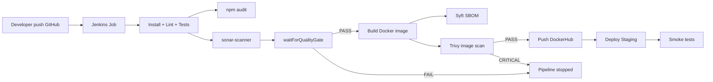

# RNCP39765 - Bloc 3 - E3 P2

## Documentation technique CI/CD - Projet CrisisView

## 1) Contexte et objectif

Le projet `CrisisView` contient:
- une API Node.js/Express (`api_crisiview`)
- un frontend Next.js (`frontend_crisisview`)
- un déploiement staging Docker Compose (`deploy/docker-compose.yml`)

L'objectif est de livrer une chaine CI/CD reproductible avec Jenkins, SonarQube et Docker, intégrant qualité, sécurité, déploiement et preuves d'exécution.

---

## 2) Architecture de la pipeline CI/CD

### 2.1 Outils

- Jenkins (orchestration CI/CD)
- SonarQube (analyse qualité + Quality Gate)
- Docker / DockerHub (build, scan, registry, déploiement)
- Trivy (scan vulnérabilités image)
- Syft (génération SBOM)
- npm audit (SCA dépendances)

### 2.2 Composants et environnements

- Jobs Jenkins:
  - `crisisview-api` (script: `api_crisiview/Jenkinsfile`)
  - `crisisview-frontend` (script: `frontend_crisisview/Jenkinsfile`)
- Projets SonarQube:
  - `crisisview-api`
  - `crisisview-frontend`
- Réseau Docker partagé: `devops`
- Staging déployé via:
  - API: `docker compose` (service `api`, dépendance `mysql`)
  - Frontend: `docker run` sur le réseau `devops`

### 2.3 Schéma logique (vue simplifiée)



### 2.4 Conditions d'exécution et gates

- Les stages de livraison (`push`, `deploy`, `smoke`) s'exécutent uniquement sur la branche `main`.
- La Quality Gate Sonar est bloquante (`waitForQualityGate abortPipeline: true`).
- Le scan Trivy est bloquant sur sévérité `CRITICAL` pour l'API.
- Si un gate échoue, la livraison est stoppée.

---

## 3) Description des pipelines

## 3.1 Pipeline API (`api_crisiview/Jenkinsfile`)

Ordonnancement principal:
1. Checkout
2. Install (`npm ci`)
3. Lint
4. Tests unitaires
5. Tests d'intégration (MySQL sidecar)
6. SCA (`npm audit`)
7. SonarQube analysis
8. Quality Gate
9. Build image Docker
10. SBOM (`syft`)
11. Scan image (`trivy`)
12. Push DockerHub
13. Deploy staging (`docker compose`)
14. Smoke test (`/health`)

Rollback API:
- Paramètre Jenkins `ROLLBACK=true`
- Redéploie le tag `previous` sans rebuild.

## 3.2 Pipeline Frontend (`frontend_crisisview/Jenkinsfile`)

Ordonnancement principal:
1. Checkout
2. Install (`npm ci`)
3. Lint
4. Tests (avec couverture)
5. SCA (`npm audit`)
6. Build Next.js
7. SonarQube analysis
8. Quality Gate
9. Build image Docker
10. SBOM (`syft`)
11. Scan image (`trivy`)
12. Push DockerHub
13. Deploy staging (`docker run`)
14. Smoke test HTTP

Rollback Frontend:
- Paramètre Jenkins `ROLLBACK=true`
- Redéploiement du tag `previous`.

---

## 4) Gestion des secrets et paramètres

Secrets Jenkins utilisés:
- `dockerhub-user`
- `dockerhub-creds`
- `sonar-token-crisisview-api`
- `sonar-token-crisisview-frontend`

Bonnes pratiques appliquées:
- Aucun token en clair dans le code.
- Credentials injectés par Jenkins.
- Analyse qualité/sécurité avant déploiement.

---

## 5) Runbook 1 - Exécuter le projet en local

## 5.1 Prérequis

- Docker + Docker Compose
- Node.js (pour exécution hors conteneur si nécessaire)

## 5.2 Lancement staging local (via compose)

Depuis la racine du projet:

```bash
docker compose -f deploy/docker-compose.yml up -d mysql api frontend
docker compose -f deploy/docker-compose.yml ps
```

Accès:
- Frontend: `http://localhost:3100`
- API: `http://localhost:3101`
- Health API: `http://localhost:3101/health`

Arrêt:

```bash
docker compose -f deploy/docker-compose.yml down
```

---

## 6) Runbook 2 - Exécuter la pipeline Jenkins (CI/CD)

## 6.1 Déclenchement

1. Ouvrir Jenkins (`http://localhost:8090`)
2. Lancer:
   - `crisisview-api`
   - `crisisview-frontend`

## 6.2 Vérifications de succès

- Build Jenkins `SUCCESS`
- SonarQube: Quality Gate `Passed`
- Images poussées sur DockerHub
- Conteneurs en état `Up` sur staging
- Smoke tests `OK`

---

## 7) Runbook 3 - MEP / rollback / maintenance

## 7.1 Mise en production/staging (pipeline standard)

- Lancer le job avec paramètres par défaut (`ROLLBACK=false`).
- Vérifier `Promote`, `Deploy`, `Smoke test` en succès.

## 7.2 Rollback

- Relancer le job avec `ROLLBACK=true`.
- Le pipeline déploie le tag précédent (`previous`).
- Vérifier que le service répond de nouveau en smoke test.

## 7.3 Maintenance courante

- Purge images inutiles (déjà prévue en post stage Jenkins).
- Vérification périodique SonarQube (gate + hotspots).
- Vérification scans Trivy et rapports SBOM.

---

## 8) Incidents courants et résolution

## 8.1 Quality Gate Sonar en échec

Symptôme:
- Pipeline stoppée à `Quality Gate`.

Actions:
1. Ouvrir le projet Sonar concerné.
2. Identifier métrique en échec (coverage, bugs, smells, etc.).
3. Corriger code/config Sonar.
4. Commit + relance pipeline.

## 8.2 Échec push DockerHub (unauthorized / scopes)

Symptôme:
- `docker push` refusé.

Actions:
1. Regénérer un token DockerHub avec droits write.
2. Mettre à jour `dockerhub-creds` dans Jenkins.
3. Relancer.

## 8.3 Smoke test en erreur `000`

Symptôme:
- Pas de connexion HTTP depuis Jenkins.

Actions:
1. Vérifier la cible smoke (`hostname/port`) selon namespace réseau Jenkins.
2. Vérifier réseau `devops` et conteneur `Up`.
3. Vérifier logs conteneur (`docker logs <container>`).

## 8.4 Trivy lent ou rapport absent

Symptôme:
- Stage Trivy très long, ou artefact manquant.

Actions:
1. Vérifier cache Trivy monté.
2. Vérifier sortie JSON archivée.
3. Contrôler connectivité DB Trivy.

---

## 9) Traçabilité et livrables techniques

Les preuves d'exécution sont stockées dans `reports/`:
- logs Jenkins complets API + frontend
- screenshots SonarQube (overview + activity + quality gate)
- screenshot `docker ps`
- rapports sécurité:
  - `npm-audit` API + frontend
  - SBOM API + frontend
  - Trivy API

Cette organisation garantit:
- reproductibilité
- auditabilité
- conformité aux attendus CI/CD + DevSecOps

